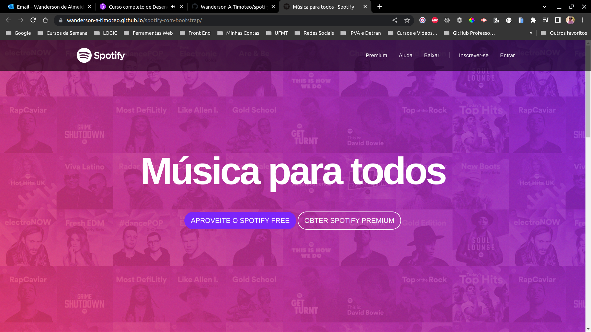
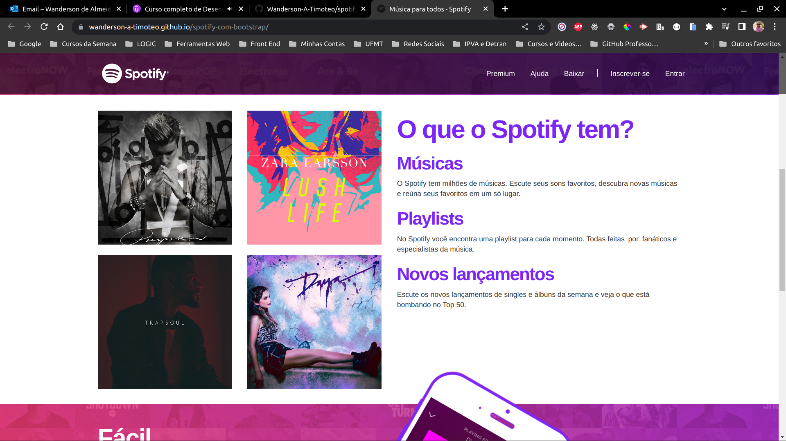
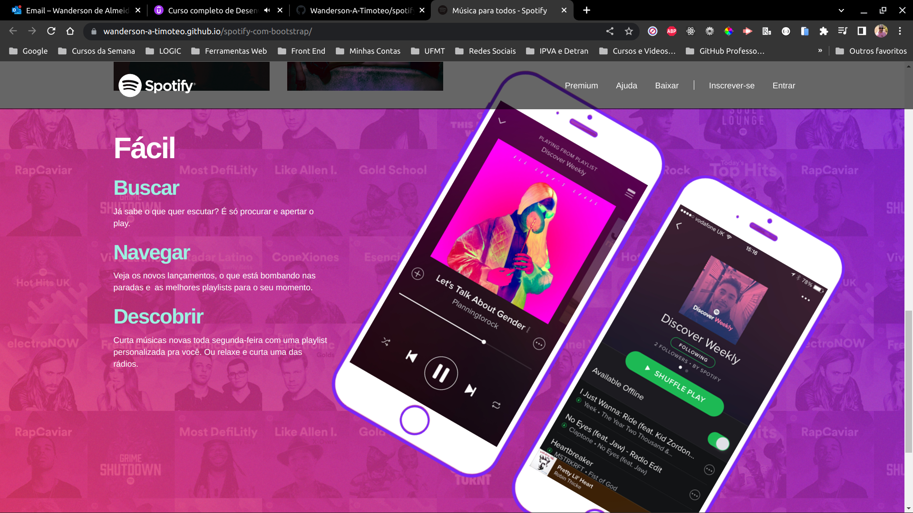

<div align="center">
  
  <h1>Spotify</h1>
</div>

<div align="center">
  <a href="#-projeto">Projeto</a>&nbsp;&nbsp;&nbsp;|&nbsp;&nbsp;&nbsp;
  <a href="#-tecnologias">Tecnologias</a>&nbsp;&nbsp;&nbsp;|&nbsp;&nbsp;&nbsp;
  <a href="#-tecnologias">Executar Aplicação</a>&nbsp;&nbsp;&nbsp;|&nbsp;&nbsp;&nbsp;
  <a href="#-licença">Licença</a>&nbsp;&nbsp;&nbsp;|&nbsp;&nbsp;&nbsp;
  <a href="#-autor">Autor</a>
</div>

<br>

<p align="center">
  
  
  
</p>

<br>

## 💻 Projeto

Projeto consiste em uma landing page simples Ui Clone Spotify, este foi desenvolvido apenas com HTML5 e Bootstrap para aprimorar minhas habilidades.

[Visitar site do projeto](https://wanderson-a-timoteo.github.io/spotify-com-bootstrap/)

<br>

### Gif da Landing Page Spotify

<p align="center">
    
</p>
<br>

### Home

<p align="center">
    
</p>
<br>

### Services

<p align="center">
    
</p>
<br>

### Para Smartphones

<p align="center">
    
</p>
<br>

## 🚀 Tecnologias

Esse projeto foi desenvolvido com as seguintes tecnologias e ferramentas:

<div align="center">
  
  
  
          
</div>

<br>

## 🔥 Executar Aplicação

### 🎇 Executando Localmente a Aplicação

Caso você deseja executar o projeto na sua máquina local, basta seguir os passos abaixo:

### 🌀 Começando...

Para começar, você deve simplesmente clonar o repositório do projeto na sua máquina.

Navegue em seu computador até o local onde você clonou o projeto, exemplo:

```sh
C:\Users\NomeDoComputador\Documents\CloneDoProjeto
```

Quando encontrar a pasta do projeto, basta acessar `spotify-com-bootstrap`.

### 🛰️ Executando o projeto

Bom, agora que esta **(dentro da pasta `spotify-com-bootstrap` do projeto clonado)**. Dentro desta pasta tem um arquivo index.html que é o arquivo principal do projeto. Clique duas vezes seguidas neste arquivo.

Pronto! dessa forma o projeto `spotify-com-bootstrap` estará rodando localmente em sua maquina.

<br>

## 🚩 Tenho Dúvidas... O que fazer?

Caso tenha dúvidas sobre o código do projeto, sintam-se a vontade em abrir uma **[ISSUE AQUI](https://github.com/Wanderson-A-Timoteo/spotify-com-bootstrap/issues)**. Assim que possível, responderei todas as dúvidas!

<br>

## 💡 Licença

Esse projeto está sob a licença MIT. Veja o arquivo [LICENSE](github/LICENSE.md) para mais detalhes.

<br>

## 🎆 Autor

Feito com ♥ by

[<br><sub>Wanderson A. Timóteo</sub>](https://www.wandersontimoteo.ga/)

<br>

## 🤝 Agradecimentos

<div align="center">
  

<br><br>

Projeto desenvolvido durante as aulas `Curso Completo Desenvolvimento Web 2018 - Crie 6 Projetos` da plataforma de ensino [Udemy](https://www.udemy.com/).
